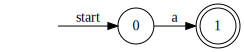

# Visualize Automata

This is basically just http://hokein.me/Automata.js/#

TODO: This is messed up right now, but this should worker:

```
npm run build
npm start
```

```
npm run build
npm run build:watch
npm run start
npm run dev           # build:watch && start
```

## Getting Running

```
npm install
npm start
```

## Example Output

Pattern: `a`


<!--  -->

Pattern: `a|b`


<!--  -->

# Also

```
node index.js
```

```
digraph finite_state_machine {
  rankdir = LR;
  node [shape = circle]; 0;
  node [shape = doublecircle]; 4;
  node [shape = plaintext];
  "" -> 0 [label = "start"];
  node [shape = circle];
  0->1 [label="ε"];
  0->2 [label="ε"];
  1->3 [label="a"];
  2->4 [label="b"];
  3->1 [label="ε"];
  3->2 [label="ε"];
}
```
